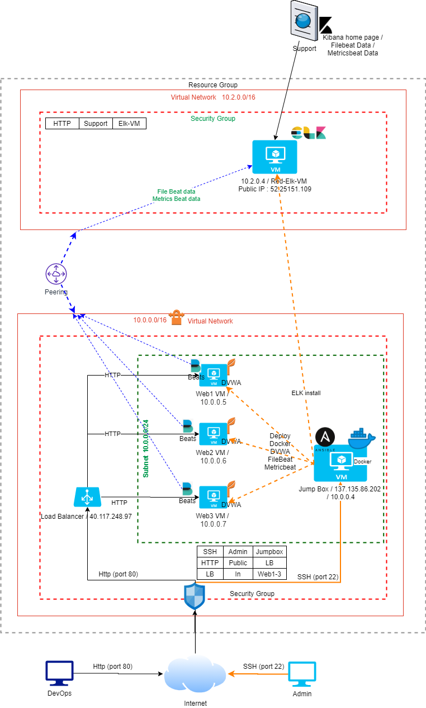
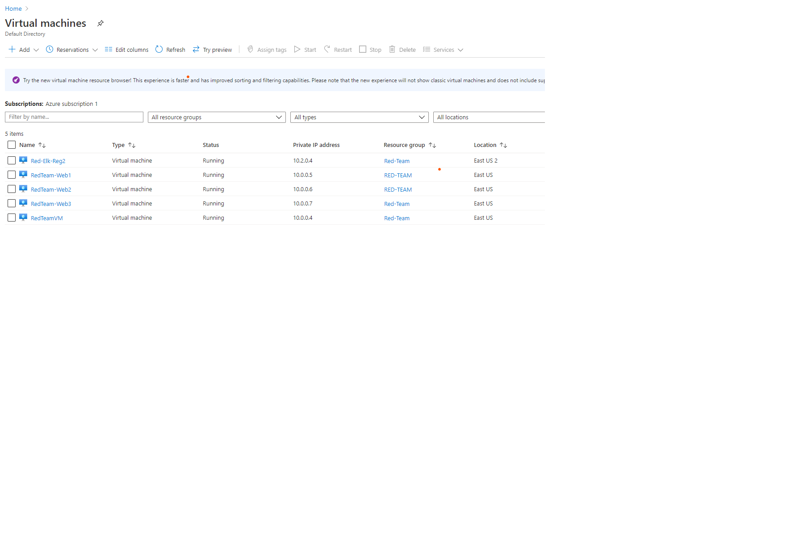
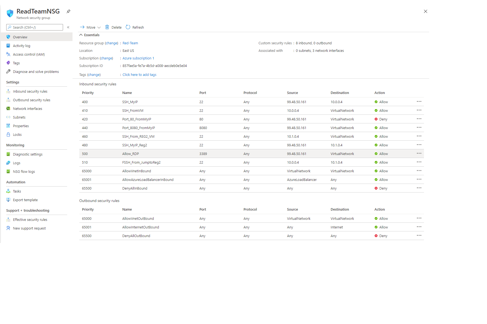
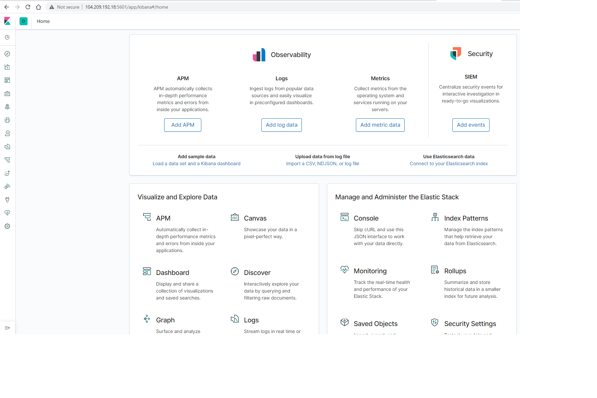
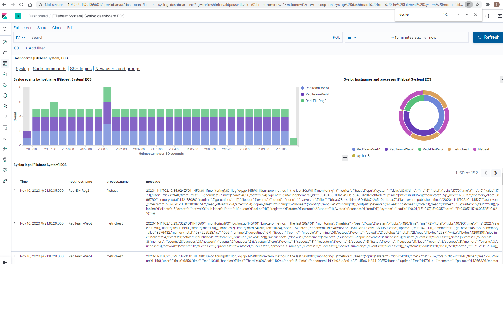
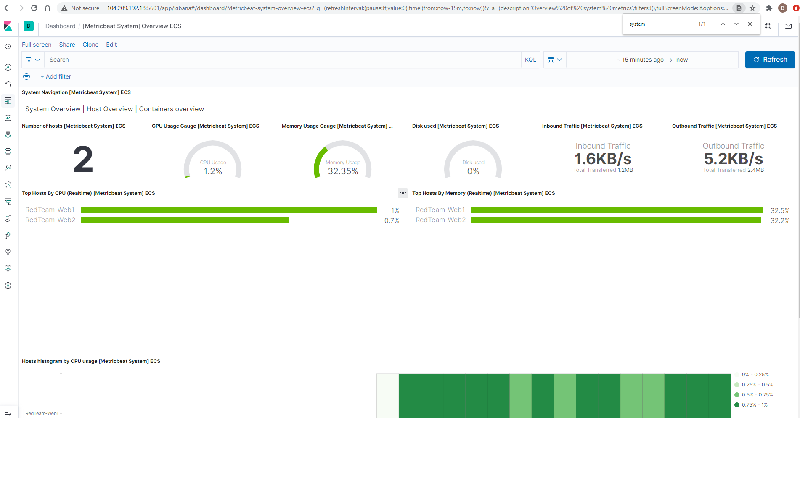

## Automated ELK Stack Deployment

The files in this repository were used to configure the network depicted below.

[]

These files have been tested and used to generate a live ELK deployment on Azure. They can be used to either recreate the entire deployment pictured above. Alternatively, select portions of the these file may be used to install only certain pieces of it, such as ELK.

  - _docker-playbook.yml_
  - _elk-playbook.yml_
  - _filebeat-playbook.yml_
  - _metricbeat-playbook.yml_

This document contains the following details:
- Description of the Topology
- Access Policies
- ELK Configuration
  - Beats in Use
  - Machines Being Monitored
- How to Use the Ansible Build

### Description of the Topology

The main purpose of this network is to expose a load-balanced and monitored instance of DVWA, the D*mn Vulnerable Web Application.

Load balancing ensures that the application will be highly available, in addition to restricting access to the network.
- _Load Balancer expose Public IP to external network. All traffics are channeled through load balancer._

Integrating an ELK server allows users to easily monitor the application logs and resource usage.
- _Filebeats are agents running on servers sending operational data to Elasticsearch_
- _Metricbeats are agents running on server to collect metrics from Operating Systems and from Services._

The configuration details of each machine may be found below.
[]

### Access Policies

The machines on the internal network are not exposed to the public Internet. 

Only the Jump Box (Red Team VM) machine can accept connections from the Internet. Access to this machine is only allowed from the following IP addresses:
- _99.48.50.161_

ELK machine is created in different Region (East US 2) / Virtual Network.
All other machines are created in EAST US region with Virtual Network
- _TODO: Which machine did you allow to access your ELK VM? What was its IP address?_

A summary of the access policies in place can be found in the Network Security Group Image below.
[]

### Elk Configuration

ELK Server is configured to use Static IP address to display Kibana Home page with Static Public IP Address : _104.209.192.18_

Ansible was used to automate configuration of the ELK machine. No configuration was performed manually, which is advantageous because all ELK servers can have same configuration and any change in configuration can be performed together.
- _Ansible can be used to automate deployment and configuration on multiple machines at the same time. Makes it manageable and controlled._

The playbook implements the following tasks:
- _Install Docker_
- _Increase Virtual Memory_
- _Download ELK image and Launch container_

The following screenshot of Kibana home page displays the result of successfully configuring the ELK instance.
[]

Security rule is created to access Kibana Home Page from Local machine : (_99.48.50.161_) 

### Target Machines & Beats
This ELK server is configured to monitor the following machines:
- _10.0.0.5, 10.0.0.6, 10.0.0.7_

We have installed the following Beats on these machines:
- _FileBeats_
- _MetricBeats_

These Beats allow us to collect the following information from each machine:
- _Filebeats are agents running on servers sending operational data to Elasticsearch_
- _Metricbeats are agents running on server to collect metrics from Operating Systems and from Services._

Filebeat Page displaying System logs is as below:
[]

Metricbeat Page displaying System Overview is as below:
[]

### Using the Playbook
In order to use the playbook, configure the Jump box as Ansible control node. The configuration should list Webservers IP addresses under as WebServers and ELK IP address as ELK server: 

SSH into the Jump box and follow the steps below:
- _Create Ansible playbook for Installing DVWA on Webservers_.
- _Create Ansible playbook for Installing ELK on ELK Server_.
- _Create Ansible playbook for Installing Filebeat on Webservres_.
- _Create Ansible playbook for Installing FMetricbeat on Webservres_.

